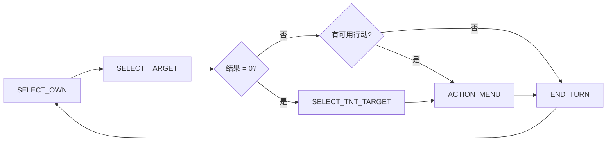

# 一加一武器版 (Tactical Arena)

一款由 **bau** 独立制作的实时多人在线战术数字对决游戏。玩家通过**模 10 加法运算**操控手牌数值（0–9），触发各类武器、组合技和圣遗物能力，以智取胜。 [4-cite-0](#4-cite-0) 

## 技术栈

| 层级 | 技术 | 职责 |
|:-----|:-----|:-----|
| 前端 | React + Vite + Tailwind CSS | UI 渲染、状态管理、VFX 特效 |
| 后端 | Node.js + Express | HTTP API（注册/登录/商城）、静态文件服务 |
| 实时通信 | Socket.io | 双向游戏状态同步 |
| 数据库 | JSON 平面文件 (`database.json`) | 用户档案、统计、库存持久化 | [4-cite-1](#4-cite-1) [4-cite-2](#4-cite-2) 

## 项目结构

```
├── server.js            # 服务端入口：HTTP API + Socket.io 网关
├── GameEngine.js        # 核心游戏引擎：回合制状态机、伤害计算、胜负判定
├── RoomManager.js       # 房间生命周期管理（创建/加入/离开/断线）
├── BotAI.js             # AI 机器人（3 种性格：狂战士/防御者/计算者）
├── database.json        # JSON 平面文件数据库
├── data/
│   ├── loot_pools.js    # 服务端奖池定义
│   └── relics/          # 圣遗物系统（基类 + 8 个模块实现）
└── client/
    ├── vite.config.js
    └── src/
        ├── App.jsx              # 应用入口与路由
        ├── socket.js            # Socket.io 客户端
        ├── constants.js         # 武器映射、段位、卡皮肤
        ├── i18n.js              # 国际化（中/英）
        ├── audio.js             # 音效管理
        ├── loot_pools.js        # 前端奖池（UI 展示用）
        ├── screens/
        │   ├── BattleArena.jsx  # 战斗竞技场 UI
        │   ├── LobbyScreen.jsx  # 大厅界面
        │   └── WarpScreen.jsx   # 星空祈愿（抽卡）界面
        ├── components/          # 通用组件
        └── relics/              # 前端圣遗物 VFX 注册表
```


## 核心玩法

### 加法运算机制

每位玩家持有两张手牌，数值范围 0–9。每回合选择自己的一张手牌与任意玩家（包括自己）的一张手牌相加，结果取**模 10**：

```
我的手牌 [7] + 对方手牌 [5] → (7 + 5) % 10 = [2]
```

加法结果会改变你选中的那张手牌的数值，不同数值对应不同的武器/效果。 [4-cite-3](#4-cite-3) 

### 武器映射表

| 数值 | 武器 | 效果 |
|:----:|:-----|:-----|
| 0 | 💣 高爆 TNT | 选择一个敌人造成 1.5 伤害 |
| 3 | 🏹 单支箭矢 | 弓/弩的弹药（1 发） |
| 4 | 🛡️ 被动护盾 | 持有时自动减免 0.5 普通伤害 |
| 5 | 🗡️ 近战利刃 | 选择一个敌人造成 0.5+ 伤害（可锻造升级） |
| 6 | 🏹🏹 双重箭矢 | 弓/弩的弹药（2 发） |
| 7 | 🏹 长弓 | 消耗 1 箭矢，造成 1 伤害 |
| 8 | 🏹 重弩 | 消耗 1-2 箭矢，造成 1-2 伤害 |
| 9 | 🧪 恢复药剂 | 凑出时自动回复 1 HP | [4-cite-4](#4-cite-4) 

### 组合技系统

当两张手牌形成特定组合时，可触发强力技能：

| 组合 | 技能 | 效果 |
|:----:|:-----|:-----|
| 4 + 5 | 锻造 | 剑等级 +1（伤害 +0.5） |
| 8 + 8 | 力量过载 | 下一次攻击伤害 x2 |
| 9 + 9 | 强效治疗 | 回复 2 HP |

在 2v2 团队模式下，组合技可以施加给队友。 [4-cite-5](#4-cite-5) 

### 游戏模式

- **经典模式 (Classic)**：2-4 人自由对战，最后存活者获胜
- **团队模式 (Team)**：2v2 对战，按加入顺序分队（1-2 号 vs 3-4 号），一方全灭则另一方获胜 [4-cite-6](#4-cite-6) [4-cite-7](#4-cite-7) 

### 回合流程



每回合限时 30 秒，超时自动跳过。 [4-cite-8](#4-cite-8) [4-cite-9](#4-cite-9) 

## 圣遗物（战术模块）系统

玩家可装备一个圣遗物芯片，改变局内战术逻辑。所有圣遗物继承自 `RelicBase` 基类，通过钩子函数介入游戏各阶段。 [4-cite-10](#4-cite-10) 

### 模块一览

| 稀有度 | 模块 | 效果 |
|:------:|:-----|:-----|
| EPIC | 🩸 吸血鬼模块 | 近战利刃造成伤害时回复 0.5 HP |
| EPIC | 🪨 重型装甲 | 最大 HP+2，但护盾失效 |
| EPIC | 🦅 鹰眼准星 | 长弓/重弩额外 +0.5 伤害 |
| EPIC | 💉 战地医疗 | 恢复药剂额外 +1 HP，但最大 HP-2 |
| EPIC | 💪 健儿 | 最大 HP+50%，受伤 x2，CR 奖励 x2 |
| LEGENDARY | 🔥 极度狂热 | TNT 伤害 +1.5，引爆自身受 1 反噬 |
| LEGENDARY | 🥷 暗影刺客 | 近战利刃伤害 +1.0，护盾失效 |
| LEGENDARY | 💻 黑客入侵 | 空手(2)变渗透门户，积攒渗透值可抵消伤害或释放终极技能 | [4-cite-11](#4-cite-11) [4-cite-12](#4-cite-12) 

## 经济与进阶系统

### 信用点 (CR)

- 对局胜利获得 100 CR，失败获得 30 CR，每次击杀额外 +20 CR
- 完成每日指令可获得额外奖励（50/80/100 CR）
- 新注册用户获赠 200 CR + 欢迎邮件（含 32,000 CR 及物资） [4-cite-13](#4-cite-13) [4-cite-14](#4-cite-14) 

### 星空祈愿 (Constellation Warp)

类似抽卡系统，使用 Three.js 渲染 3D 星空场景，点击星座触发抽取：

- **单次观测**：160 CR
- **深度观测 (x10)**：1,600 CR
- 三档稀有度：RARE (3★) / EPIC (4★) / LEGENDARY (5★)
- 保底机制：4★ 保底 10 抽，5★ 保底 50 抽
- 重复物品自动退款（5★=800 CR, 4★=200 CR, 3★=30 CR）

可获取物品包括：战术称号、特工边框、全息卡槽、倒计时法阵、战术模块等。 [4-cite-15](#4-cite-15) 

### 黑市 (Market)

使用 CR 直接购买基础外观物品。 [4-cite-16](#4-cite-16) 

### 每日指令

| 指令 | 目标 | 奖励 |
|:-----|:-----|:-----|
| 嗜血渴望 | 累计处决 3 名特工 | 50 CR |
| 战术狂热 | 完成 5 场模拟 | 100 CR |
| 火力倾泻 | 累计造成 20 点伤害 | 80 CR | [4-cite-17](#4-cite-17) 

## 社交系统

- **好友系统**：发送/接受好友请求，查看好友在线状态
- **私信 (PM)**：与好友实时聊天
- **CR 转账**：向好友转移信用点（10% 手续费）
- **特工档案**：查看任意玩家的胜率、对局数、段位、签名
- **邮件系统**：收发邮件，支持附件（物品/CR），一键领取
- **房间内聊天**：对局中实时文字聊天
- **表情系统**：对局中发送快捷表情（❓💀🥶🔥） [4-cite-18](#4-cite-18) [4-cite-19](#4-cite-19) 

## 段位系统

| 胜场 | 段位 |
|:----:|:-----|
| 0+ | 🥉 黑铁特工 |
| 10+ | 🥈 白银先锋 |
| 30+ | 🥇 黄金精英 |
| 60+ | 💎 钻石大师 |
| 100+ | 🌌 欧米茄 | [4-cite-20](#4-cite-20) 

## 个性化外观

| 类型 | 说明 |
|:-----|:-----|
| 作战视界 | 战场背景主题（深空星海、赛博矩阵、液态幽能、神秘漂流、狂乱视界、量子跃迁） |
| 特工边框 | 头像边框样式（标准隐蔽、霓虹流光、地狱烈焰、鎏金矩阵） |
| 全息卡槽 | 手牌卡面皮肤（高透玻璃、骇客指令、鲜血盛宴） |
| 倒计时法阵 | 回合计时器特效环（烈焰灼心、霜寒凝脉、魔法符文、赛博序列、虚空湮灭、时序逆流） |
| 战术称号 | 显示在头像上方的称号 |
| 个性签名 | 特工档案中的自定义签名（限 20 字） | [4-cite-21](#4-cite-21) 

## AI 机器人

支持注入 AI 机器人填充空位，3 种性格策略：

| 名称 | 性格 | 策略 |
|:-----|:-----|:-----|
| AI_Ghost | 狂战士 | 优先凑 TNT(0) 和利刃(5) |
| AI_Specter | 防御者 | 低血量时优先治疗(9)和护盾(4) |
| AI_Phantom | 计算者 | 优先击杀低血量敌人，卸除对方重火力 |
| AI_Clone | 随机 | 随机行动 | [4-cite-22](#4-cite-22) 

## 国际化

支持中文和英文双语切换。 [4-cite-23](#4-cite-23) 

## 快速开始

```bash
# 1. 克隆仓库
git clone <repo-url>
cd reOPOWEd

# 2. 安装服务端依赖
npm install

# 3. 构建前端
cd client
npm install
npx vite build
cd ..

# 4. 启动服务器
node server.js
# >>> TACTICAL_ARENA PHASE 2 SERVER ONLINE ON PORT 3000 <<<
```

打开浏览器访问 `http://localhost:3000` 即可开始游戏。 [4-cite-24](#4-cite-24) 

## 开发模式

```bash
# 终端 1：启动后端
node server.js

# 终端 2：启动前端开发服务器（热更新）
cd client
npx vite
# 访问 http://localhost:5173，API 请求自动代理到 :3000
``` [4-cite-25](#4-cite-25)
